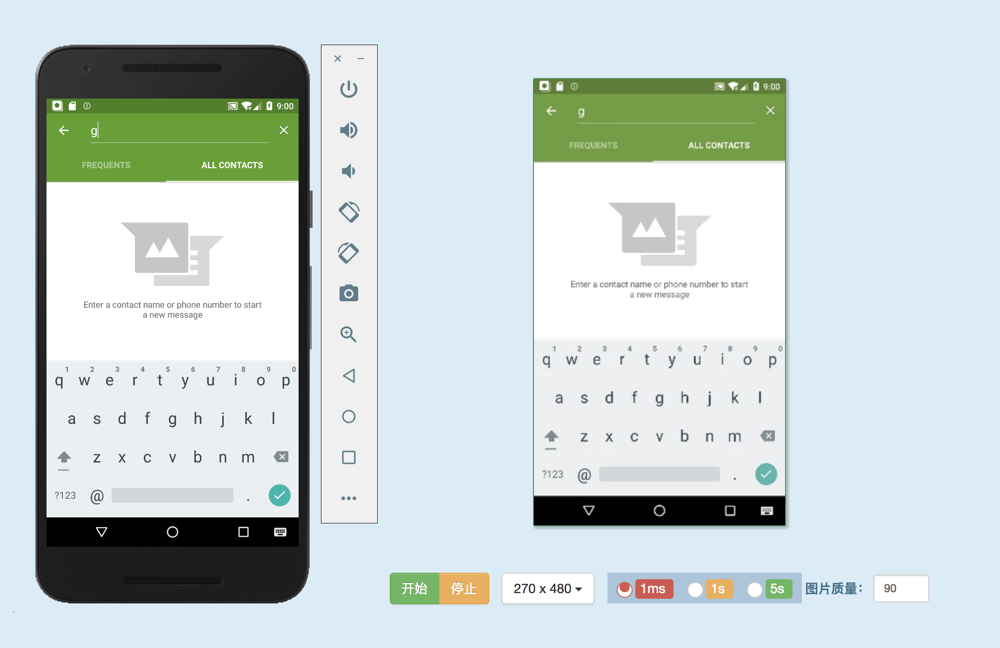
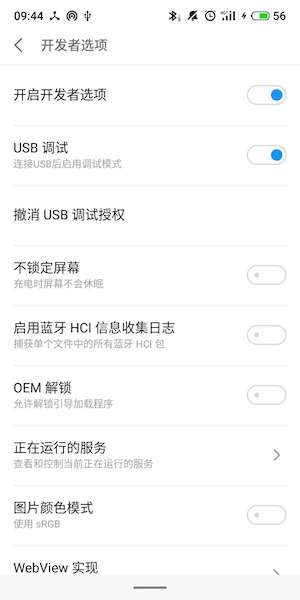
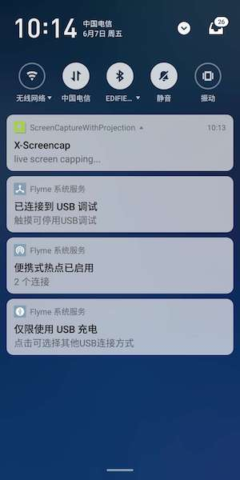
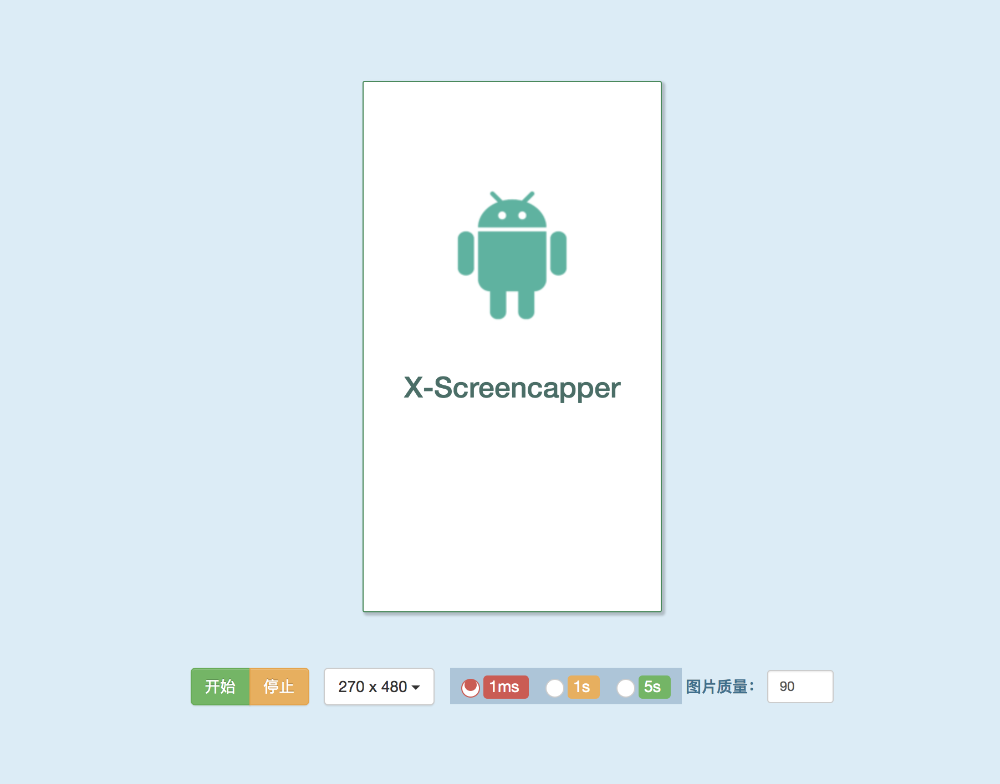

# XScreencapper Android截屏大师

这是一个轻量、开发友好的Android手机截屏工具，提供多种自定义的指令，从而满足不同的场景，例如**监控**、**群控**等等。

兼容Android5.0+以上的主流Android手机，提供优质、持续的截图流，相比目前的主流截图方案，不仅比adb稳定可靠，更支持最高30FPS的稳定截图流，可满足大部分的使用场景。

#### 效果图



>### 支持的指令

#### start

启动截屏服务

#### stop

关闭截屏服务

#### size

改变截屏尺寸大小，如 `360x640`

#### frequency

改变截屏频率，以毫秒值为单位，如 `1000` 代表每秒截一次

#### quality

图片质量，支持范围 `40-100`


>### 部署

- 克隆客户端工程 **`XScreencapperClient`**

该工程是连接截图服务、获取截图流的client端实现，目前主要支持Python、Java和NodeJs版本

```
git clone https://github.com/flash-kk/XScreencapperClient.git
```

- 手机通过USB接入电脑，并打开**`开发者选项`**和**`USB调试`**



- 使用adb命令打开端口转发

```
cd XScreencapperClient/scripts
./reset-forword.sh 9999
```

- 安装`XScreencapper-v1.0.0.apk`到手机,点击启动后，默认会监听在手机的`9999`端口

注意该应用无界面，仅显示一个前台通知



- 启动python客户端工程

```
cd XScreencapperClient/web
python server.py
```

- 打开[首页](http://0.0.0.0:5000/static/index.html)，效果图

#### 起始页



#### 截屏页

